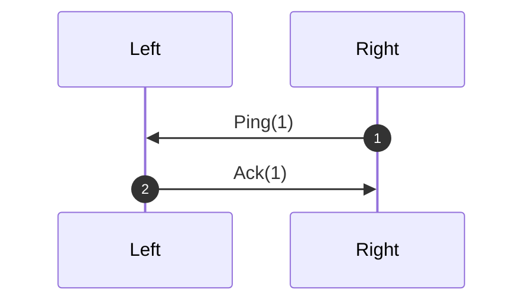

# Description

The two halves of the keyboard communicate over a full duplex system over 2 wires on a TRRS cable.
Messages over the protocol include:
 - Press and Release of keys
 - Changing RGB animations
 - ...

Both sides stream bit by bits qwords of 32 bits size.  Sometimes those qword end up being corrupt
and thus a protocol is needed to ask the other side to replay them.  From
experience, the corruption occurs on maximum 5 successive messages.

# Protocol
Each message is attached a 5bits sequence identifier (sid) that is strictly
increasing.  The receiver will acknowledge the reception of each
message by sending back the sid of the message.

The sender keeps a window of 32 elements and will resend the message if the
receiver asks for it.  A ping message is sent every 3s to check if the other
side is still alive.  Given that the sequence id is strictly increasing, this
mechanism enables the receiver to detect if a message was lost.

## Simple Ping-Ack

# Message serialization
Each message can be serialized in 16 bits.  To ensure reception and
deserialization, the message is sent twice with a CRC16 appended at the most
significant bits.

On those 16 bits, the first 5 bits are the sequence identifier (sid).  Then
the next 3 bits are the message type.  The rest of the bits are the payload.
