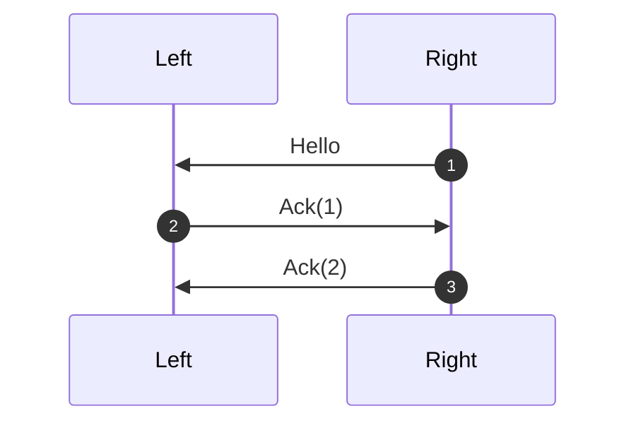
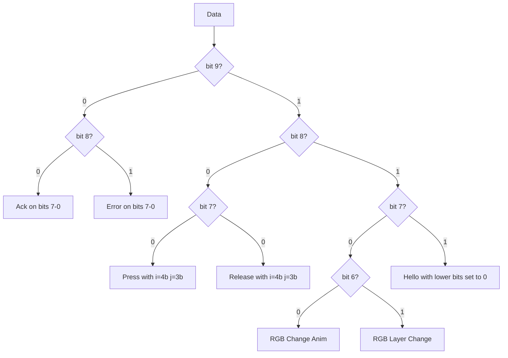

# Description 

The two halves of the keyboard communicate over a full duplex system over 2 wires on a TRRS cable.
Messages over the protocol include:
 - Press and Release of keys
 - Changing RGB animations
 - ...

Both sides stream bit by bits qwords of 32 bits size.  Sometimes those qword end up being corrupt
and thus a protocol is needed to ask the other side to replay them.

# Protocol
Each message is attached a 8bits sequence identifier (sid).

## Handshake

# Message serialization
Each message can be serialized in 10 bits and deserialized using the folloring diagram:

